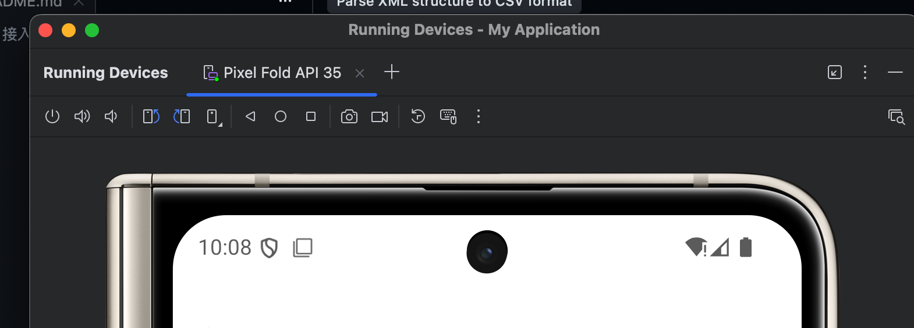
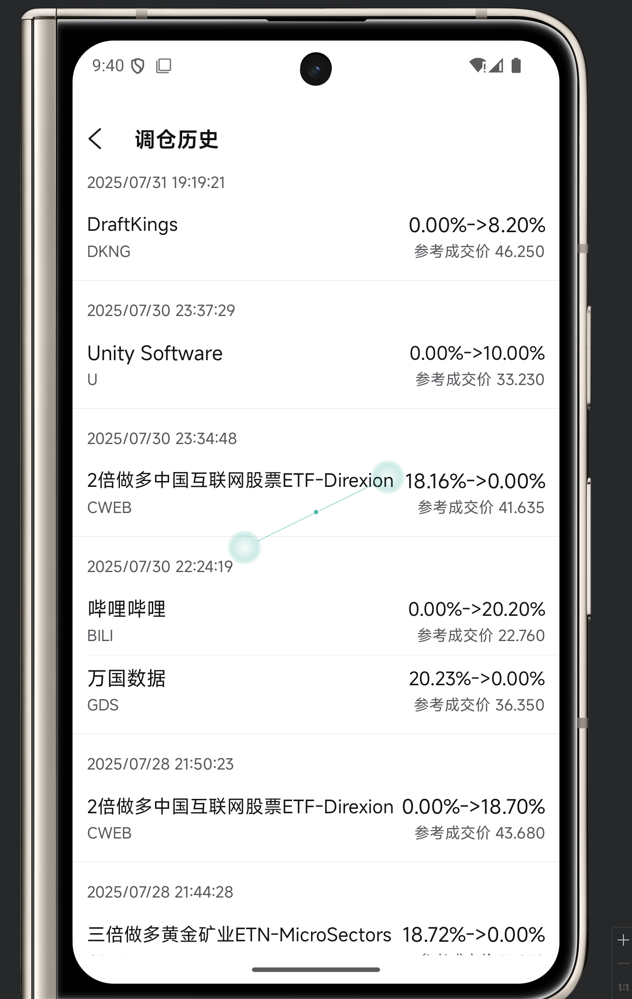

# Node.js 执行 ADB 命令示例

FUTU 调仓信息提取

## 前提条件

1. **安装 ADB 工具**
   - 下载 Android SDK Platform Tools
   - 或者单独安装 ADB 工具
   - 确保 `adb` 命令在系统 PATH 中可用

2. **Android 设备设置**（二选一）
   - 开启开发者选项
   - 启用 USB 调试
   - 连接设备到电脑并授权调试

3. **Android 模拟器**（二选一）
   - 打开模拟器 Android studio



3. **Node.js 环境**
   - Node.js 版本 >= 12.0.0

## 快速开始

### 去futu官网下载apk
#### 模拟器安装（推荐）
安装到模拟器

#### 真机调试

自用的安卓机打开 usb 调试授权（需要注意打开屏幕常亮，不休眠）

## 列出可用的设备
```bash
# 列出可用的设备
adb devices

```

## 替换 simple-example.js 的 deviveid

```bash
const UIHierarchyParser = require('./xmlparser');
const DEVICE_ID = 'emulator-5554' ## 替换掉
async function main() {
```

## 打开futu需要关注的某个大v 的调仓记录



## 启动抓取脚本

```bash
node ./simple-example.js
```

### 获取提取内容
提交内容会自动生成在 data.csv

当然也可以选择接入各种消息机器人

示例
```bash
DraftKings,0.00%->8.20%,DKNG,参考成交价 46.250
```

## 接入长桥模拟盘（可选）

将你的key妥善保存在一个文件上面
修改这个路径

```javascript
const config = JSON.parse(fs.readFileSync('/Users/shein-andyzhou/Documents/PM/keysss.txt', 'utf8'));
  const conf = new Config({ ...config, enablePrintQuotePackages: true });
```

### 运行

```bash
node ./trade.js
```

### 现有不足
* 没有记录当前的lastcommit 导致每次拉去到内存的都是最新的，会自动触发一次交易检查。
* 没有实现一分钟订单如果未成交自动取消功能